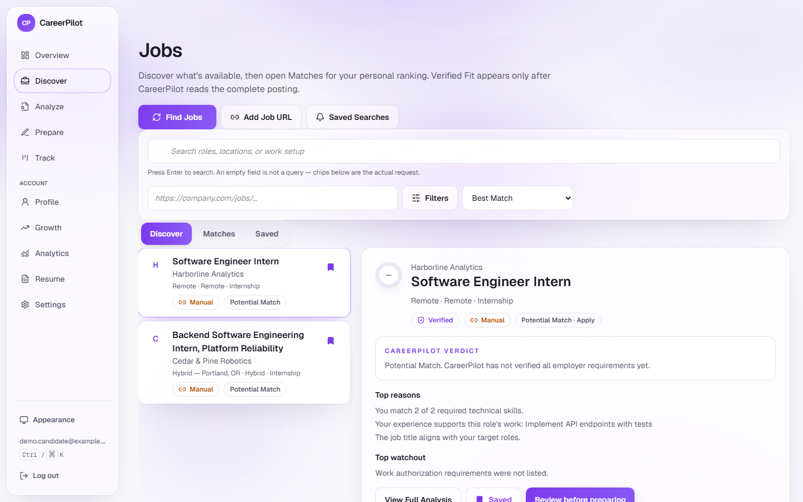
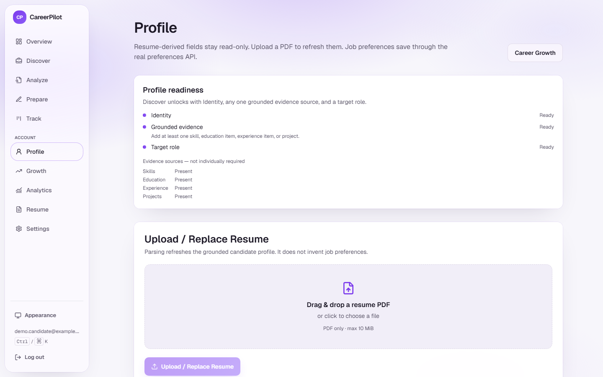
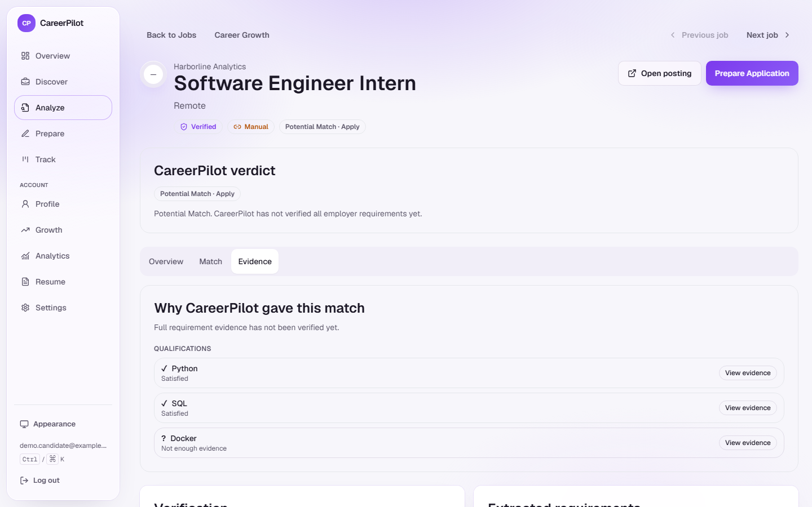
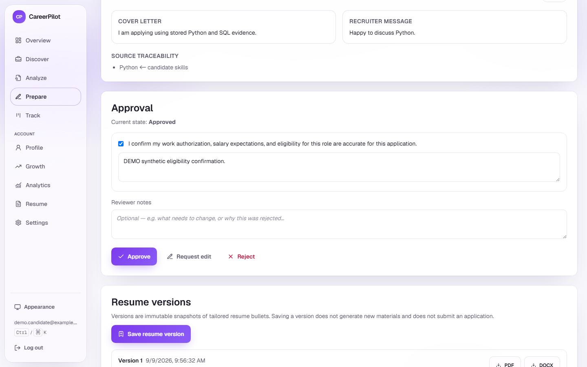
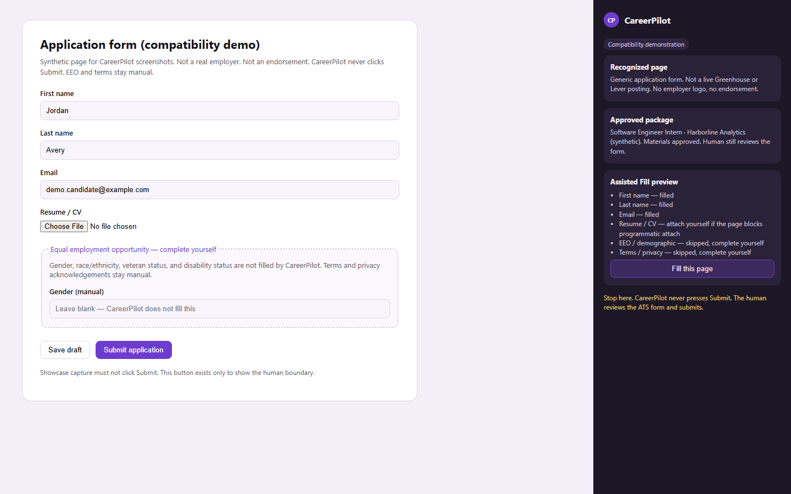
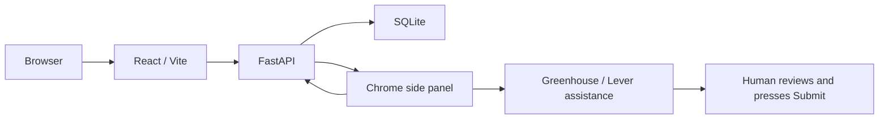

# CareerPilot

Grounded job search. Human-approved applications.

CareerPilot is a local/self-hostable workspace that turns a real resume into a grounded profile, ranks jobs with explainable Fit, and drafts application materials that stay drafts until you approve them. An unpacked Chrome extension can assist Greenhouse and Lever forms. CareerPilot never submits an application. You review the ATS form and press Submit.

[](https://github.com/ManpreetS2/CareerPilot/releases/tag/v1.0.0)
[](https://github.com/ManpreetS2/CareerPilot/actions/workflows/ci.yml)
[](https://github.com/ManpreetS2/CareerPilot/actions/workflows/security.yml)
[](https://github.com/ManpreetS2/CareerPilot/releases/tag/v1.0.0)
[](https://github.com/ManpreetS2/CareerPilot/releases/tag/v1.0.0)

**Release:** [v1.0.0](https://github.com/ManpreetS2/CareerPilot/releases/tag/v1.0.0) · tagged `b73a983ed3605d498aa90070c3b5f786a73bc525` · certified runtime `7b6c3ee100ca4fe6399ac29441bece8df71783c7`

There is no hosted demo and no Chrome Web Store listing. Run it locally.



## Why CareerPilot is different

- **Grounded evidence** — skills and claims have to come from stored resume or posting text, or they stay unknown.
- **Deterministic Fit** — scoring does not require an LLM. Missing evidence is not a silent yes.
- **Human-approved materials** — generated bullets remain drafts until you confirm eligibility.
- **Provenance / staleness** — fingerprint changes invalidate Fit, Match Evidence, and reviewed packages instead of reusing them.
- **User-scoped private data** — scores, tracker, analytics, saved searches, and resume versions do not leak across accounts.
- **Safe Greenhouse/Lever Fill** — unpacked Chrome side panel, ATS posting identity, truthful resume attachment.
- **Never auto-submits** — EEO, terms, and Submit stay human. Tracker `applied` is recorded by you.

## Product workflow

```text
Profile → Discover → Analyze → Prepare → Track
```









More screenshots, demo scripts, and architecture: [`docs/showcase/README.md`](docs/showcase/README.md).

## Product destinations

Primary web navigation is workflow-first:

- Overview (`/dashboard`)
- Discover (`/jobs`)
- Analyze (`/jobs/:jobId`, or `/analyze` when no job is selected)
- Prepare (`/jobs/:jobId/prepare`, or `/prepare` when no job is selected)
- Track (`/track`; `/applications` is the same tracker)

Supporting destinations: Profile, Interview Coach (on Job Detail), Career Growth (`/growth`), Conversion Analytics (`/analytics`), Resume, Settings.

Analyze and Prepare stay contextual under a selected job. Interview Coach remains on Job Detail. Application Tracker is a first-class Track destination with Kanban and list/timeline views. Discover can save searches with in-app unseen match counts (no email). Track follow-up dates can export as `.ics` or a Google Calendar URL (no Google Calendar OAuth). Career Growth is advisory only: it never changes Fit scores. The unpacked Chrome extension assists Greenhouse and Lever Fill only; it never submits, never fills EEO/demographic fields, and never acknowledges terms/privacy for you.

Public routes: `/`, `/login`, `/signup`, `/privacy`. New signup continues through `/onboarding`.

## MVP workflow

```
Resume
→ Candidate Profile
→ Job Discovery
→ Job Verification
→ Job Intelligence
→ Fit Score
→ Ranked Jobs
→ Tailored Application Materials
→ Human Approval
→ Immutable Resume Version
→ Assisted Application
→ Interview Preparation
```

## Architecture

These are layers inside **one local application**, not separately deployed microservices.



Shared job catalog vs user-scoped private records, deterministic Fit vs provider-backed extract/materials, and job sources: [`docs/showcase/architecture.md`](docs/showcase/architecture.md).

| Layer | Stack |
| --- | --- |
| Backend API | FastAPI + Uvicorn |
| Frontend | React + TypeScript + Vite + Tailwind CSS + customized shadcn/Radix primitives |
| Data fetching | TanStack Query |
| Database | SQLite via SQLAlchemy (`data/careerpilot.db`, gitignored) |
| Schemas | Shared Pydantic models |
| LLM | Thin `LLMClient` for Ollama, Gemini, Anthropic, and OpenAI. Candidate profile, Job Intelligence, application materials, and mock-interview answer feedback try providers in `LLM_PROVIDER_ORDER` (one provider at a time). Fit scoring stays deterministic. `DEFAULT_LLM_PROVIDER` is only the prompt harness default when `--provider` is omitted. |
| Browser extension | Unpacked Chrome extension with a side panel and approved Greenhouse/Lever autofill. It never submits. |

```
CareerPilot/
├── backend/              # FastAPI app, DB, schemas, services
├── frontend/             # React + Vite UI
├── browser-extension/    # Local Chrome extension (never submits)
├── tests/                # pytest (isolated in-memory SQLite)
├── scripts/              # Privacy-safe matrix runners and audits
├── docs/                 # Product and developer-handoff notes
├── data/                 # SQLite file (gitignored)
├── logs/                 # runtime logs (gitignored)
├── .env.example
├── requirements.txt
└── README.md
```

## Current status

CareerPilot v1 is an authenticated **local/self-hostable** product. It is not a production hosted SaaS. Signup, login, logout, and `GET /api/auth/me` exist. Private records (candidate, preferences, scores, materials, tracker rows, interview prep, form-fill attempts, analytics events, saved searches, resume-version files) are scoped to the signed-in user. Jobs and job intelligence remain shared catalog data.

**Shipped in this repo**

- Signup / login / logout / `/api/auth/me` with an HttpOnly session cookie (`careerpilot_session`)
- CSRF origin checks for cookie-authenticated state changes
- CORS from exact `ALLOWED_ORIGINS` plus an optional exact `EXTENSION_ORIGIN`
- `COOKIE_SECURE` required when `APP_ENV=production`
- Extension session header accepted only on the exact autofill route from the configured extension origin
- Profile-first gates: Discover / Find Jobs / saved-search create / Career Growth / Analytics require a usable candidate profile and at least one target role
- Grounded candidate profile, job scout/verification/intelligence, fit scoring, materials, approval, assisted apply, tracker APIs, interview prep, and immutable resume versions
- Application materials are generated from stored evidence. Provider-backed generation depends on configured Ollama/Gemini/Anthropic/OpenAI availability
- Mock-interview answer feedback is ephemeral (not stored) and follows `LLM_PROVIDER_ORDER`
- Track (`/track`) with a user-set follow-up date. Export as `.ics` or a Google Calendar template URL. CareerPilot does not send email, SMS, or push reminders and does not OAuth into a calendar account
- Saved searches on Discover (`/api/saved-searches`) with owner-scoped in-app unseen matches. No email or push alert
- Conversion Analytics (`/analytics`) — read-only funnel over the signed-in user's own application events
- Account deletion from Settings (revokes every session and owner-scoped private rows; shared job catalog remains)
- Process-local login throttling (generic errors on failed login; no email-existence leak on login)
- Grounded Match Evidence with fingerprint staleness and canonical skill aliases
- Unpacked Chrome extension: Greenhouse and Lever assisted Fill, truthful resume attachment, never Submit

Ordinary page loads for Overview, Discover, Job Detail, Prepare, Track, Analytics, Profile, Resume, Settings, and Career Growth do not score a job, extract requirements, generate materials, approve, scout, or create a resume version by themselves. Career Growth and Analytics only read stored evidence. Find Jobs persists a deterministic fit score (`score_job`) for each scoreable listing and does not call an LLM. Calculate Fit, Generate Materials, Prepare Interview, Approve, Save Resume Version, and extension Fill stay explicit. Approval still requires the grounded/current-owner gate and eligibility confirmation.

Job discovery currently supports Greenhouse, Lever, Remotive, Adzuna, RemoteOK, Jobicy, Himalayas, and manual posting URLs. Assisted Fill supports **Greenhouse and Lever only**. The Jobs workspace uses a compact list plus desktop preview, internships/full-time/both title filter, and previous/next job navigation.

Approved resume versions can be downloaded as PDF or DOCX from Prepare. The Chrome extension can download the same owned files and may attach them to a recognized Greenhouse/Lever resume file field. A matching filename alone is not proof of attachment. If the page blocks programmatic attachment, the side panel says so and asks you to attach the file yourself.

Live Greenhouse and Lever Fill were certified on Chrome 152 (release gate A8). Unit tests still do not replace a live ATS re-check after fill or attachment code changes. The extension never submits.

**Legacy local data**

Rows created before auth (`user_id` NULL) are **not** auto-assigned. To attach them to one existing account, run the dry-run CLI first:

```bash
python scripts/claim_legacy_ownership.py --user-id <id>
python scripts/claim_legacy_ownership.py --user-id <id> --apply --confirm
```

Writing the production file `data/careerpilot.db` also requires `--confirm-production-database`. The command never runs during startup, imports, tests, or CI.

**Still out of scope**

- Production hosting / SaaS operations
- Password reset
- Email verification
- Live-provider verification in CI
- Automatic job application submission (the human always presses Submit)
- Email alerts
- Billing
- Calendar account OAuth / synced calendar accounts
- Auto-apply
- Assisted Fill for ATS vendors other than Greenhouse and Lever


## Privacy and safety

- Automated tests use isolated in-memory SQLite. They must never create or mutate `data/careerpilot.db`.
- Logs use IDs, counts, and exception types, not passwords, tokens, resumes, prompts, generated materials, or raw exception text that may contain those values.
- Validation errors never echo submitted `input` values.
- No candidate skill, employer, metric, or education claim may be invented without stored evidence.
- Assisted apply and the browser extension **never click submit**. The human reviews and submits.
- Page load for Jobs, Job Detail, Prepare Application, Fit Score, Resume, and Interview Prep is read-only. Calculate Fit and generation run only on an explicit user action. Find Jobs also persists a deterministic fit score for scoreable listings (no LLM).
- Private records are user-scoped. Shared job titles may be visible to every signed-in user; scores, recommendations, packages, tracker state, approval, interview evidence, Career Growth aggregates, analytics events, and saved searches are not.
- You can delete your account from Settings. That removes owner-scoped private data and revokes sessions. It does not delete the shared job catalog.
- Vulnerability reports: see [`.github/SECURITY.md`](./.github/SECURITY.md).

## Setup

Requires **Python 3.11+**. **Node.js 22.12+** is recommended (CI uses Node 22). **Node.js 20.19+** is supported. The committed frontend lockfile graph includes packages that declare `^20.19.0 || ^22.12.0 || >=24.0.0`; do not assume Node 20.0 works.

### Backend

```bash
python -m venv .venv
```

(`python3.11 -m venv .venv` is fine if that is how Python 3.11 is named on the machine.)

macOS / Linux:

```bash
source .venv/bin/activate
```

Windows:

```bash
.venv\Scripts\activate
```

```bash
pip install -r requirements.txt
python -m playwright install chromium
cp .env.example .env
```

Add `GEMINI_API_KEY` (and optional Anthropic/OpenAI keys) to `.env` for Gemini fallback. Never commit `.env`.

Ollama is optional but recommended on the host PC:

```
OLLAMA_BASE_URL=http://127.0.0.1:11434
OLLAMA_MODEL=qwen3:14b
LLM_PROVIDER_ORDER=ollama,gemini
```

Teammate devices do **not** install Ollama or pull `qwen3:14b`. They run CareerPilot locally and send inference to the host through Tailscale Serve, using a placeholder like this only in their own gitignored `.env`:

```
OLLAMA_BASE_URL=https://<host-device>.<tailnet>.ts.net
OLLAMA_MODEL=qwen3:14b
LLM_PROVIDER_ORDER=ollama,gemini
```

Rules:

- Only the host installs Ollama and pulls `qwen3:14b`.
- Keep Ollama bound to `127.0.0.1:11434`. Never set `OLLAMA_HOST=0.0.0.0`.
- Use Tailscale Serve to proxy that loopback port inside the tailnet. Never use Tailscale Funnel. Never port-forward or firewall-open port 11434.
- The host must stay powered on, awake, running Ollama, and connected to Tailscale.
- Each developer keeps a separate gitignored `.env` and a separate Gemini key. Never send an API key through Git or chat.
- If the host is unavailable, Gemini is attempted next. Without a configured Gemini key, fallback cannot succeed.
- CareerPilot never pulls models automatically.

Auth settings in `.env`:

- `ALLOWED_ORIGINS` — comma-separated exact `http://` or `https://` frontend origins. No `*`, path, query, or fragment. Credentialed CORS never uses a wildcard.
- `COOKIE_SECURE=false` for local http. `APP_ENV=production` refuses to start unless `COOKIE_SECURE=true`.
- `EXTENSION_ORIGIN` — blank, or one exact `chrome-extension://<extension-id>` origin. The session header is accepted only on the autofill route from that origin.

Database tables are created on API startup, or manually:

```bash
python -m backend.db.init_db
```

### Frontend

```bash
cd frontend
cp .env.example .env.local
npm ci
```

`VITE_API_BASE_URL` defaults to `http://<this-page-hostname>:8000` for local
aliases (`localhost` and `127.0.0.1`). Opening the UI at either hostname talks
to the matching API host so the `SameSite=Lax` session cookie stays first-party.
A copied local alias is rewritten the same way. An explicit non-local URL is
left unchanged. Do not set `VITE_API_BASE_URL=http://localhost:8000` in
`.env.local` if you also open the app at `http://127.0.0.1:5173`.

### Browser extension

The extension is not published to the Chrome Web Store. Load it unpacked after a build:

1. `cd browser-extension && npm ci && npm run build`
2. Start the backend (`python -m uvicorn backend.main:app --host 127.0.0.1 --port 8000`) and approve at least one Greenhouse or Lever application.
3. Open `chrome://extensions`, enable Developer mode, and **Load unpacked** on the `browser-extension/` folder (the folder that contains `manifest.json`, not `dist/`).
4. Copy the extension id into `.env` as `EXTENSION_ORIGIN=chrome-extension://<id>` and restart the API.
5. Open the side panel on a real Greenhouse posting or Lever `/apply` page and fill from approved materials.
6. Review flagged fields, EEO/demographic questions, and terms/privacy yourself. The extension never submits.

See `browser-extension/README.md` for selector, CSP, and attachment details.

## Run

Use the **same hostname** for the UI and API (`127.0.0.1` with `127.0.0.1`, or `localhost` with `localhost`). Mixing them splits the `SameSite=Lax` session cookie.

Terminal 1 — backend:

```bash
source .venv/bin/activate
python -m uvicorn backend.main:app --reload --host 127.0.0.1 --port 8000
```

Windows PowerShell/cmd: `.venv\Scripts\activate` then the same `python -m uvicorn` command.

- API: http://127.0.0.1:8000
- Docs: http://127.0.0.1:8000/docs
- Health: http://127.0.0.1:8000/health

Terminal 2 — frontend:

```bash
cd frontend
npm run dev
```

- UI: http://127.0.0.1:5173 (or http://localhost:5173 if the API was bound to localhost)

## Tests

Backend (isolated SQLite, fake/blocked providers, no `data/careerpilot.db`):

```bash
python -m pytest -q
python scripts/test_fit_scoring_matrix.py
python scripts/test_candidate_profile_matrix.py --synthetic
python -m pytest tests/test_job_intelligence.py tests/test_job_intelligence_pipeline.py -q
python scripts/verify_mapped_paths.py
python scripts/check_tracked_secrets.py
```

Frontend:

```bash
cd frontend
npm run test:run
npm run typecheck
npm run build
```

CI (`.github/workflows/ci.yml`) runs pytest, the MVP / Job Intelligence / CORS browser workflows, frontend unit tests, frontend typecheck and production build, the browser-extension tests/typecheck/build, Python and npm dependency audits, `git diff --check`, and the tracked-secret audit on Python 3.11 and Node.js 22. Playwright Chromium is installed for Form Fill fixture tests.

Optional live LLM smoke test (not part of CI):

```bash
python -m backend.utils.prompt_harness --provider ollama --prompt "Reply with one sentence confirming CareerPilot can reach the LLM."
python scripts/smoke_ollama.py
```

`scripts/smoke_ollama.py` checks `/api/tags` and one tiny schema-constrained reply. It does not run in CI, does not pull models, does not write application data, and does not print the endpoint, prompts, or secrets.

Optional host live check against a temporary database (also not CI):

```bash
python scripts/live_ollama_gemini_check.py
```

## Ollama troubleshooting

- Host not serving: confirm Ollama is running and `http://127.0.0.1:11434/api/tags` works on the host only.
- Teammate cannot reach the host: install the official Tailscale client, join the same invited tailnet, and put the private Serve URL only in that device's gitignored `.env`.
- Same-machine Serve URL may return 403; that is a Tailscale identity check, not public exposure. The teammate should verify `/api/tags` from their own device.
- Gemini fallback used: the host was offline, timed out, or returned unusable structured output. Check that a Gemini key exists on that machine.
- Never expose Ollama on the public internet.

## Git and release workflow

Do **not** commit directly to `main`. Work on feature branches and merge through pull requests. v1 feature development is frozen. A8/A9/Phase 6 certified runtime SHA `7b6c3ee100ca4fe6399ac29441bece8df71783c7`. Annotated tag `v1.0.0` points at `b73a983ed3605d498aa90070c3b5f786a73bc525`: https://github.com/ManpreetS2/CareerPilot/releases/tag/v1.0.0

## Demo path

A recruiter can follow the product without extra tooling.

Spoken script and screenshot recapture: [`docs/showcase/demo-script.md`](docs/showcase/demo-script.md). Operator boot: [`docs/demo-runbook.md`](docs/demo-runbook.md). Isolated synthetic data: `python scripts/seed_showcase_demo.py --database <temp.sqlite>` (refuses `data/careerpilot.db`).

Canonical clicks:

1. Sign up
2. Complete Profile (identity + grounded evidence + at least one target role)
3. Discover → Find Jobs
4. Analyze a listing (Match / Evidence)
5. Prepare materials, review eligibility, and approve
6. Track status

Optional: Career Growth, Analytics, Interview Coach on Job Detail, Resume library, saved searches (in-app only), follow-up `.ics` / Google Calendar URL, Chrome extension on Greenhouse/Lever (never submits).

## Useful API routes

| Method | Path | Notes |
| --- | --- | --- |
| `POST` | `/api/auth/signup` | Create account and set session cookie |
| `POST` | `/api/auth/login` | Log in |
| `POST` | `/api/auth/logout` | Revoke session |
| `GET` | `/api/auth/me` | Current user |
| `GET` | `/api/profile` | Current candidate and latest preferences (read-only) |
| `DELETE` | `/api/account` | Delete account and owner-scoped private data |
| `POST` | `/api/parse-resume` | Grounded candidate profile |
| `POST` | `/api/preferences` | Reusable application answers |
| `POST` | `/api/scout-jobs` | Live job discovery |
| `POST` | `/api/jobs/ingest-url` | Manual posting URL |
| `POST` | `/api/jobs/verify` | Verification sweep |
| `GET`/`POST` | `/api/jobs/{job_id}/intelligence` | Stored / extract Job Intelligence |
| `GET` | `/api/jobs/{job_id}/match-evidence` | Stored Match Evidence (read-only) |
| `GET` | `/api/jobs/{job_id}/score` | Stored fit score (read-only; 404 if missing) |
| `GET` | `/api/jobs/scores` | Stored scores for the Jobs page (read-only) |
| `POST` | `/api/jobs/{job_id}/score` | Fit & Gap (explicit) |
| `GET` | `/api/jobs/{job_id}/materials` | Stored grounded materials (read-only; 404 if missing) |
| `POST` | `/api/jobs/{job_id}/generate-materials` | Grounded materials (explicit) |
| `POST` | `/api/jobs/{job_id}/approve` | Approval Agent |
| `POST` | `/api/jobs/{job_id}/fill-application` | Assisted apply preview (never submits) |
| `GET` | `/api/extension/autofill` | Browser extension field values |
| `GET` | `/api/applications` | Tracker list (read-only) |
| `GET`/`PATCH` | `/api/applications/{job_id}/tracking` | Explicit tracker updates, including optional follow-up date |
| `GET` | `/api/applications/{job_id}/reminder.ics` | Owner-only follow-up calendar file (no calendar OAuth) |
| `GET` | `/api/dashboard/summary` | Real stored metrics |
| `GET` | `/api/analytics/summary` | Owner-only conversion funnel (read-only) |
| `GET`/`POST` | `/api/saved-searches` | Saved searches (create requires profile readiness; no email) |
| `GET` | `/api/career-growth` | Read-only Skills Gap / Career Growth from stored evidence |
| `GET` | `/api/resume-versions` | Owner-scoped immutable resume version summaries |
| `GET` | `/api/resume-versions/{version_id}` | Historical resume version detail (no hashes or raw snapshot) |
| `GET`/`POST` | `/api/jobs/{job_id}/resume-versions` | Per-job list / explicit save |
| `GET` | `/api/jobs/{job_id}/interview-prep` | Read-only stored prep |
| `POST` | `/api/jobs/{job_id}/prepare-interview` | Deterministic baseline (explicit) |
| `POST` | `/api/jobs/{job_id}/interview-prep/feedback` | Ephemeral mock-interview answer feedback (`LLM_PROVIDER_ORDER`) |

## License and source use

CareerPilot is source-visible for portfolio, evaluation, and collaboration purposes, but it is not an open-source project.

Unless a file explicitly states otherwise, original CareerPilot source is protected by copyright and no permission is granted to copy, modify, redistribute, sublicense, sell, deploy, or create derivative works without prior written permission from the applicable copyright holder(s).

Third-party dependencies remain subject to their own licenses.

See [LICENSE](./LICENSE).
