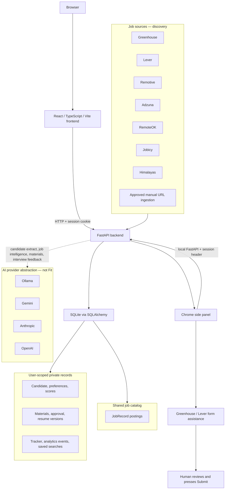

# Architecture

CareerPilot is **one local/self-hostable application**. The boxes below are process layers, not separately deployed services and not a hosted SaaS.

## Deterministic vs provider-backed

| Kind | What |
| --- | --- |
| **Deterministic** | Fit scoring. Find Jobs may persist those scores after an explicit click. No LLM required. |
| **Provider-backed** | Candidate extraction where applicable, job intelligence, application materials, mock-interview answer feedback. Tries `LLM_PROVIDER_ORDER` (Ollama, Gemini, Anthropic, OpenAI). Failures stay honest. |

## Isolation

- **Shared:** job catalog (`JobRecord`) and stored job intelligence for a posting.
- **Private:** candidate profile, preferences, scores, materials, approval, tracker, interview prep, form-fill attempts, analytics events, saved searches, resume-version files.

Account deletion removes owner-scoped private rows and sessions. It does not delete the shared catalog.

## What this diagram does not claim

- Microservices, Kubernetes, or production cloud hosting
- Auto-submit, email alerts, or Google Calendar OAuth
- Assisted Fill for ATS vendors other than Greenhouse and Lever
- Infinite scale
