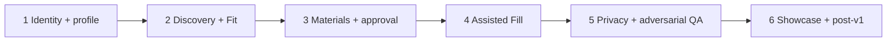

# 02 — Roadmap and milestones

Retrospective TPM roadmap based on what actually shipped — not a forward fantasy plan.

When early planning differed from the final design, that difference is called out as program evidence.

## Milestone overview

---

## Milestone 1 — Identity + grounded candidate profile

| Field | Detail |
| --- | --- |
| **Objective** | Establish signed-in ownership and a resume-backed profile that gates discovery |
| **Dependencies** | Auth/session before private rows; isolated SQLite for tests |
| **Deliverables** | Signup/login/session; onboarding/profile; profile readiness gate; resume parse into candidate evidence |
| **Owner / workstream** | Shared/platform (auth, ownership); Developer A (shell/onboarding UI); Shared (candidate profile contracts) |
| **Acceptance gate** | Incomplete profile cannot scout; completing minimum profile unlocks Discover; second-user login does not flash prior user data |
| **What changed** | Profile-first gating became a hard product invariant, not a soft UX hint. Ordinary page loads stayed read-only unless explicitly documented |
| **Final status** | Shipped and certified under A9 / workflow checklist |

---

## Milestone 2 — Job discovery + explainable Fit

| Field | Detail |
| --- | --- |
| **Objective** | Discover jobs from real sources and score Fit without pretending incomplete postings are fully known |
| **Dependencies** | Ready profile; job catalog persistence; requirement extraction / content status |
| **Deliverables** | Seven discovery sources + manual URLs; Job Scout adapters; deterministic Fit V2; Verified vs Potential semantics; Jobs/Job Detail UI that does not overclaim unverified percentages |
| **Owner / workstream** | Developer B (adapters/verification); Shared (Fit/scoring contracts, evidence); Developer A (Jobs UI surfaces) |
| **Acceptance gate** | Discovery gated by profile; Fit is deterministic (not LLM-dependent for score); incomplete content cannot look fully authoritative |
| **What changed** | **Original Job Intelligence path did not represent full employer requirements.** Incomplete posting content made Fit look more authoritative than evidence justified. Program response: requirement profiles, content status, deterministic mining with AND/OR groups, eligibility, **Verified vs Potential Fit**, Top-N full-posting verification without sending all listings to Gemini. Job Intelligence remained for materials/interview — narrower than an “AI scores everything” vision. See [`docs/agile-plan-gap-audit.md`](../agile-plan-gap-audit.md) |
| **Final status** | Shipped; Fit V2 is the scoring contract |

---

## Milestone 3 — Grounded materials + human approval

| Field | Detail |
| --- | --- |
| **Objective** | Generate application materials only from current evidence, then require human eligibility confirmation |
| **Dependencies** | Current Fit/evidence footprints; candidate + posting fingerprints; provider availability for generation (not for Fit) |
| **Deliverables** | Grounded materials or visible `grounding_override`; Prepare workflow; explicit approval gate; approval does **not** mark tracker `applied` |
| **Owner / workstream** | Developer A (Prepare UI/workflow); Shared (grounding + approval contracts); providers as external dependency |
| **Acceptance gate** | Stale fingerprints invalidate materials; approval requires eligibility confirmation; no silent claim inflation |
| **What changed** | Pipeline orchestrator stayed narrower than early “full agent pipeline” language. Grounding override became an explicit, visible path rather than a silent bypass |
| **Final status** | Shipped; Prepare + approval on critical path to Fill |

---

## Milestone 4 — Assisted application workflow

| Field | Detail |
| --- | --- |
| **Objective** | Assist form fill on supported ATS pages without submitting or touching sensitive fields |
| **Dependencies** | Approved owner-scoped materials; exact ATS posting identity; Chrome unpacked extension loaded against local API |
| **Deliverables** | Extension Fill for Greenhouse + Lever; ATS-ID identity (never fuzzy title/company); truthful resume attachment verification; no `submit()` / `requestSubmit()` / Enter-to-submit; EEO/terms manual |
| **Owner / workstream** | Developer B (extension + ATS identity); Shared (auth cookie / ownership for materials); Developer A (web UX that explains the boundary) |
| **Acceptance gate** | **A8** live Chrome Greenhouse + Lever on certified runtime |
| **What changed** | Scope stayed at two certifiable ATS integrations instead of shallow “universal ATS.” Attachment success requires live Resume/CV input/widget proof — filename match alone is not enough |
| **Final status** | Certified on runtime SHA `7b6c3ee…` (Chrome 152) |

---

## Milestone 5 — Privacy + adversarial QA + release certification

| Field | Detail |
| --- | --- |
| **Objective** | Prove isolation, deletion, and cross-feature resistance; freeze a release decision with provenance |
| **Dependencies** | Code freeze for runtime under test; automated CI green; isolated QA databases |
| **Deliverables** | A9 isolation/IDOR/deletion; Phase 6 adversarial audit; Phase 7 release-truth docs; Phase 8 annotated `v1.0.0` tag |
| **Owner / workstream** | Shared/platform (privacy, release gates); all workstreams for adversarial coverage |
| **Acceptance gate** | No open P0/P1; certified runtime documented separately from tag SHA |
| **What changed** | Release management explicitly separated **certified runtime** (`7b6c3ee…`) from **docs/version SHA** (`3196e18…`) and **tag** (`b73a983…`). Later showcase commits do not recertify Fill |
| **Final status** | Complete. Tag immutable. Checklist: [`docs/V1_RELEASE_CHECKLIST.md`](../V1_RELEASE_CHECKLIST.md) |

---

## Milestone 6 — Showcase + post-v1 maintenance

| Field | Detail |
| --- | --- |
| **Objective** | Make the shipped product interview/portfolio-legible without moving the release tag or claiming uncertified runtime |
| **Dependencies** | Frozen v1.0.0 provenance; triage of post-tag correctness and dependency PRs |
| **Deliverables** | `docs/showcase/`; demo seed/runbook; visual QA notes; post-v1 maintenance triage; this TPM case study |
| **Owner / workstream** | Shared/docs; product owners triage open maintenance PRs separately |
| **Acceptance gate** | Showcase must not claim hosted SaaS, universal ATS, or auto-submit; open PRs stay backlog unless merged to main and separately accepted |
| **What changed** | Screenshot/showcase QA found product-vs-presentation gaps (copy clarity, boundary mocks). Non-critical UX polish deferred rather than destabilizing certified Fill. Open correctness PRs (#125–#127) and docs (#131) remain **post-v1** unless/until merged |
| **Final status** | Showcase shipped on main after tag; maintenance PRs open as backlog/risk evidence |

---

## Planning vs outcome (TPM evidence)

| Original / early framing | Final state | Why it changed |
| --- | --- | --- |
| Job Intelligence as broad understanding of requirements | Requirement profiles + deterministic Fit; JI kept for materials/interview | Incomplete postings made authoritative Fit unsafe |
| Broad “AI everywhere” scoring | Deterministic Fit; LLM for extract/materials/interview where designed | Reliability, cost, and explainability |
| Wide ATS automation appetite | Two live-certified Fill paths | Acceptance evidence over breadth |
| Formal migration tooling assumed later | Still `create_all` + `_add_missing_columns` (no Alembic) | Accepted technical debt; documented |
| Hosted product aspirations | Local / self-hostable v1 | Scope control for interview-ready ship |

## Critical path summary

Identity → profile evidence → posting requirements → Fit → materials → approval → Fill → tracker/analytics → freeze → live acceptance → tag → showcase/maintenance (non-recertifying).
