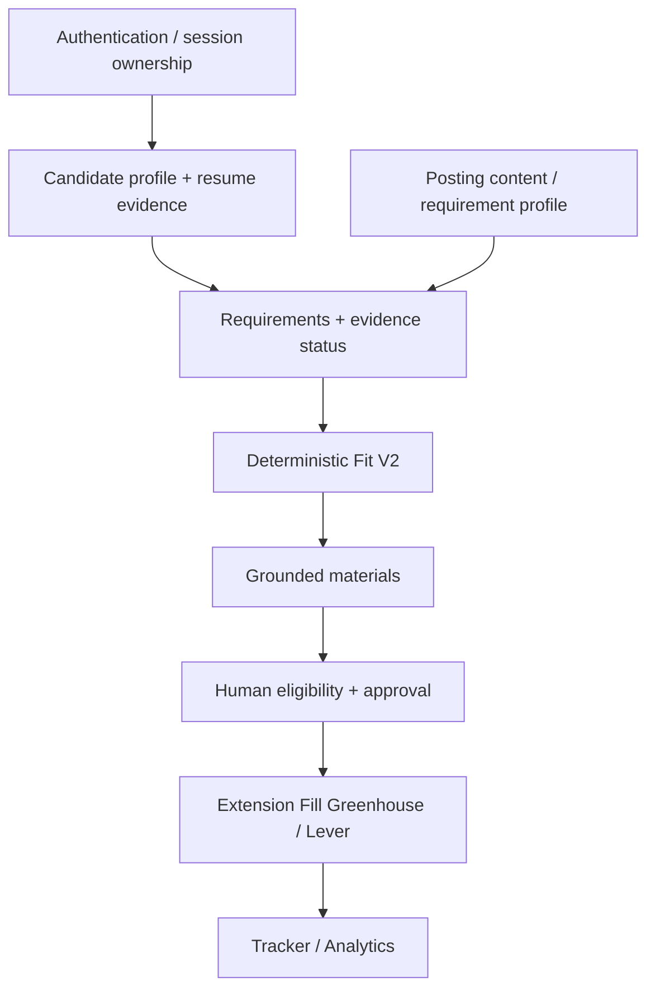
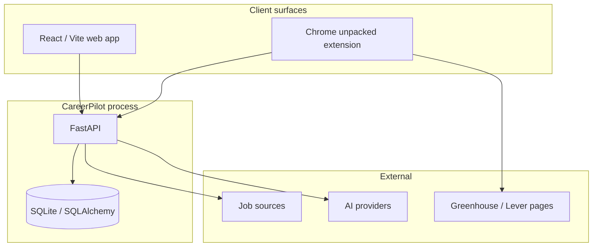

# 03 — Dependency map

Real critical-path and cross-cutting dependencies for CareerPilot v1.

Architecture context: [`docs/showcase/architecture.md`](../showcase/architecture.md).

## Critical path (product)



| Edge | Why it blocks the next step |
| --- | --- |
| Auth → profile | Private candidate rows are owner-scoped; no anonymous Fit/materials package |
| Profile + posting → requirements/evidence | Fit needs both sides; incomplete posting must surface as content status, not invent requirements |
| Requirements/evidence → deterministic Fit | Score is computable only from structured evidence; LLM outage must not block Fit |
| Current Fit/evidence → materials | Fingerprints invalidate stale packages; generation must not outrun evidence |
| Grounded materials + eligibility → approval | Human confirms eligibility; approval ≠ applied |
| Approved owner-scoped materials + ATS identity → Fill | Extension fills only with exact Greenhouse/Lever posting identity and owned materials |
| Application events → Tracker / Analytics | Human-recorded applied state; analytics is read-only owner funnel |
| Code freeze + automated gates → live ATS/privacy acceptance → release/tag | CI cannot prove browser/ATS or cross-user isolation alone |

## System topology (not microservices)

One local app — not separately deployed services:



**Shared job catalog** (`JobRecord` and related posting rows) vs **user-scoped private records** (profile, scores packages, materials, tracker, analytics events, saved searches, resume-version files). Account deletion removes owner-scoped private data and sessions; shared catalog remains.

## Workstream dependency contracts

| Contract | Producer | Consumer | Failure mode if unstable |
| --- | --- | --- | --- |
| Session / ownership headers | Shared | All private APIs + extension | Cross-user leakage or fail-open IDOR |
| Profile readiness | Shared + A | Discover / scout | Ungated discovery; wasted provider/scout work |
| Fit / evidence payload | Shared + B | A (Match/Evidence UI), materials | Misleading UI or stale materials |
| Approval eligibility | Shared + A | Extension Fill | Fill without human gate |
| ATS posting identity | B | Extension | Wrong-job fill / identity collision |
| Grounding + fingerprints | Shared | Materials + Prepare | Silent reuse of stale claims |

## Cross-cutting dependencies

| Concern | Why it is cross-cutting | Program control |
| --- | --- | --- |
| **User ownership** | Every private row and file | Session checks; A9; analytics/saved-search isolation |
| **Staleness fingerprints** | Candidate/preference/requirement changes | Invalidate Fit/evidence/materials where designed |
| **Exact ATS identity** | Fill correctness | ATS posting IDs; never fuzzy title/company |
| **Test DB isolation** | Safety of local `data/careerpilot.db` | Temp/copied SQLite only in automated and destructive QA |
| **Provider availability** | Materials/interview/extract | Fit remains deterministic; degrade generation visibly |
| **Safe logging** | Privacy | No secrets or private payloads in logs/CI artifacts |
| **Secret scanning** | Release hygiene | Full-history Gitleaks + tracked-secret scripts |

## Release dependency chain

```text
feature complete on candidate runtime
  → CI green (pytest, frontend, extension, audits, mapped paths, whitespace, secrets)
  → code freeze for acceptance SHA
  → A8 live ATS + A9 privacy on that SHA
  → Phase 6 adversarial (no open P0/P1)
  → Phase 7 docs/version metadata (separate SHA)
  → Phase 8 annotated tag v1.0.0
  → post-tag showcase / maintenance (does not move tag; does not inherit A8/A9)
```

## Known structural debt dependency

**No Alembic.** Persistence uses `Base.metadata.create_all` plus `_add_missing_columns()` / `_add_missing_indexes()` in `backend/db/init_db.py`. New tables are relatively safe; large ALTER piles against a long-lived `data/careerpilot.db` are not. Documented in [`docs/agile-plan-gap-audit.md`](../agile-plan-gap-audit.md). This is accepted v1 debt, not a silent “migration system exists” claim.
